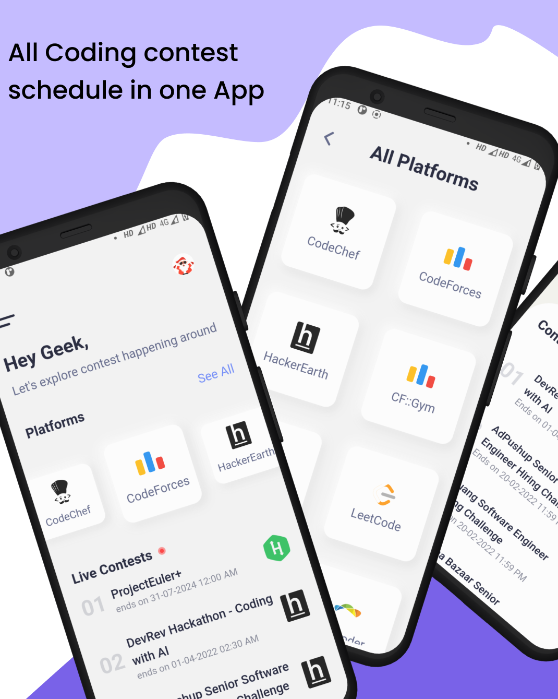
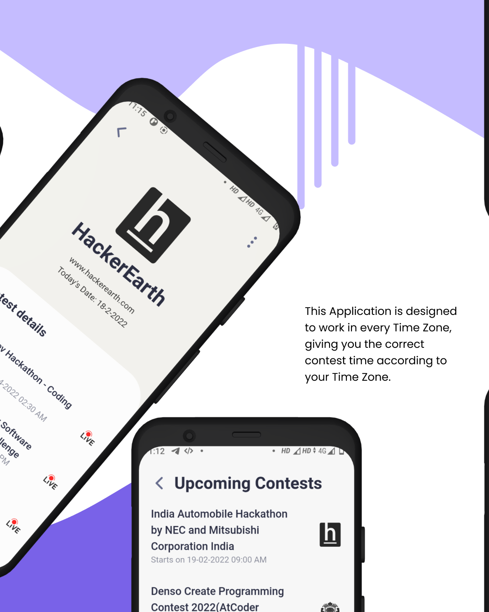
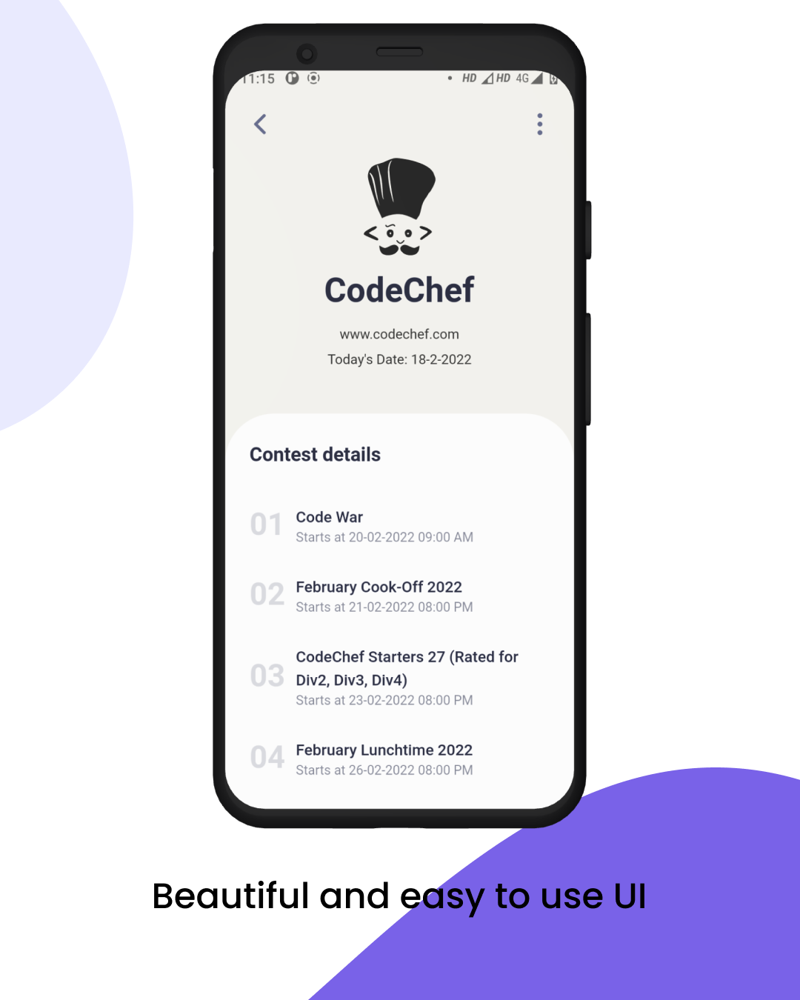
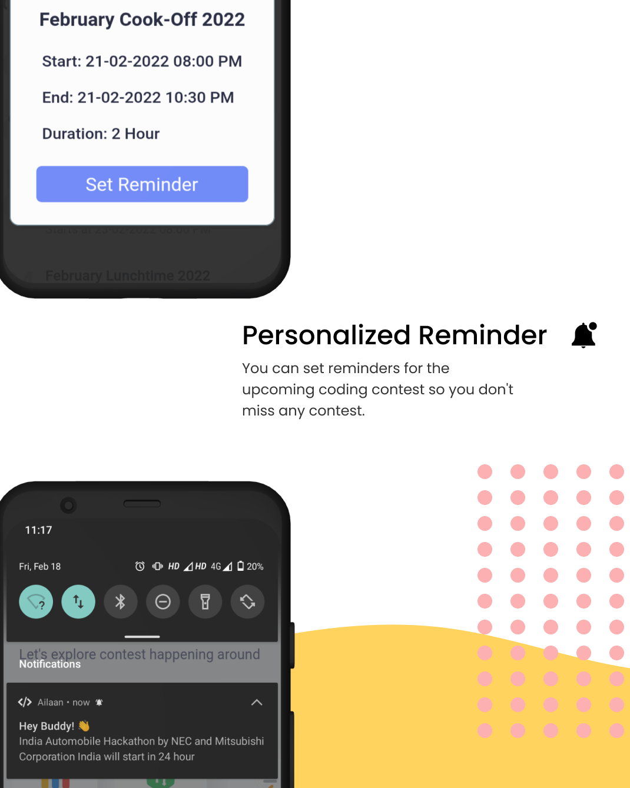
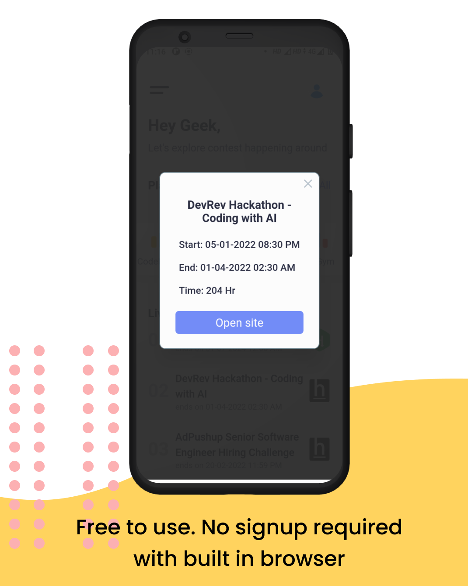
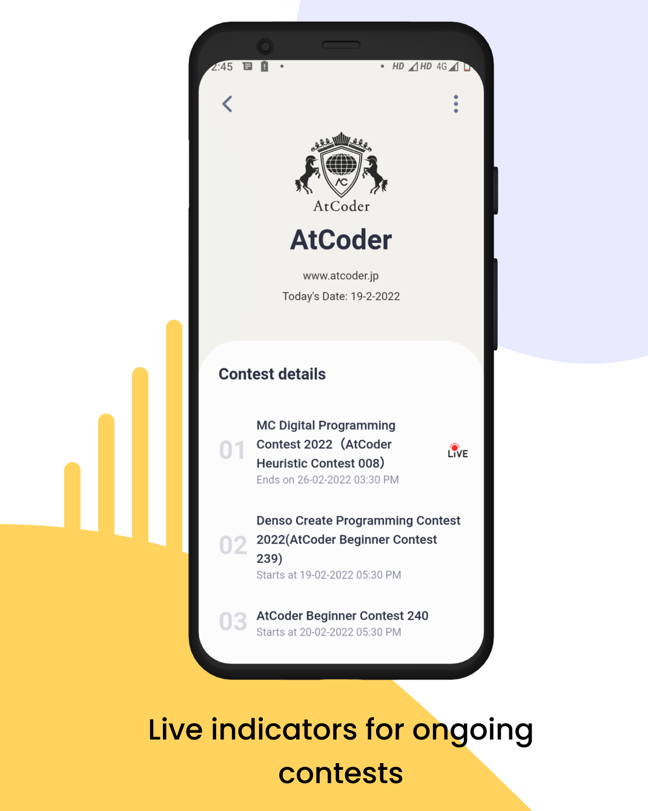
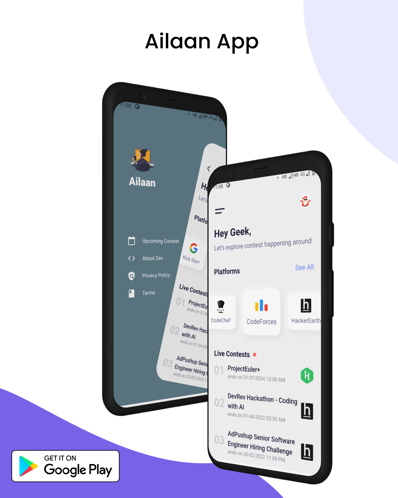

# Ailaan App

Ailaan brings all running and future coding contest schedules between your hands from many different Coding Platforms. We believe we can save your time and let you touch the information from different sites, in one app. Ailaan App can set reminders for the upcoming coding contest so you don't miss any contest. This Application is designed to work in every Time Zone, giving you the correct contest time according to your TimeZone.


## Features

- Ability to set reminders for any upcoming contest.
- The app will remind you before 24 hours, 1 hour & 5 min.
- You can open a contest website in the app itself.
- Details of live coding contests and hackathons.
- All time zones are supported.
- Requires no extra permissions.
- This app is very easy to use and has a high priority to the   user's comfort.


## Supported Coding Platforms
- CodeChef
- LeetCode
- Hackerrank
- HackerEarth
- TopCoder
- CsAcadmey
- Google kickstart
- AtCoder
- CoderForces


## Screenshots










## Run Locally

Clone the project

```bash
  git clone https://github.com/Tanay-Gupta/AilaanApp
```

Go to the project directory

```bash
  cd AilaanApp
```

Install dependencies

```bash
  flutter pub get

```

Run the app:

```bash
  flutter run

```


## Contributing

Contributions are welcome! If you have any feature requests or bug reports, please feel free to open an issue or a pull request.

See `contributing.md` for ways to get started.

Please adhere to this project's `code of conduct`.


## License

This project is licensed under the [MIT License](https://choosealicense.com/licenses/mit/).


